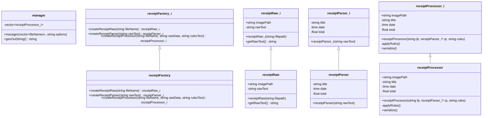
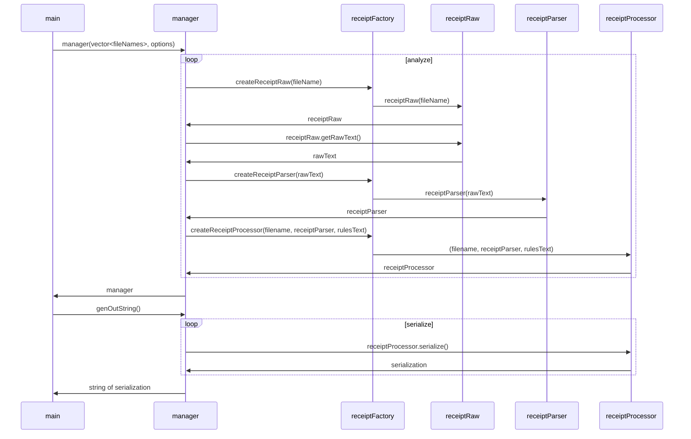

# receiptReader
Reads images of receipts and creates a JSON file of the aggregation of the data (title, date, total).  A JSON of `rules.json` can be used to override values for a specific filename.

## Development Environment
1. In *env* folder, create a docker image of the environment by running
```
docker build . -t receipt_reader_devenv
```
Note: if you plan on pushing commits to the remote from inside the docker 
environment, then you'll need to copy your .ssh files into your docker 
envrionment.
- [Generating a new SSH key](https://docs.github.com/en/authentication/connecting-to-github-with-ssh/generating-a-new-ssh-key-and-adding-it-to-the-ssh-agent)
- [Adding a new SSH key to your GitHub account](https://docs.github.com/en/authentication/connecting-to-github-with-ssh/adding-a-new-ssh-key-to-your-github-account)
You'll then have to copy your private .ssh key (`id_ed25519`) and `known_hosts`
to `env/.ssh`.  See the *Dockerfile* for details.  Comment this section out
of the Dockerfile if you don't care to add this functionality or you want to
use another method (E.G.: generate keys from within the container.)

2. Create an interactive container of the image:
```
docker run -it -v C:\Users\okina\receiptReader\:/receiptReader --name rrenv receipt_reader_devenv
```
You can close/open this container and attach to it using VSCode's `Attach to 
Running Container` command.

## OpenCV Management Ideas:
1. ~~Submodule~~
    - seems to slow down git in docker environment
2. apt-install
    - https://vitux.com/opencv_ubuntu/
      - `apt install libopencv-dev python3-opencv`
    - (-) windows VSCode will think there are errors
      - solution: make script to copy from container filesystem to shared dir
    - (-) cmake variables will not be able to be passed to external build
      - solution: minimal factor: openCV doesn't seem to get configured much
3. add in a .gitignored folder (`extern`)
    - must manually acquire extern copy
    - (-) building openCV will probably take several hours

## OpenCV Resources:
- [OpenCV Docs Example Text Detection](https://docs.opencv.org/4.x/db/da4/samples_2dnn_2text_detection_8cpp-example.html)
  - immediately unclear to me
- [OpenCV-Free-Course](https://opencv.org/opencv-free-course/)
  - no ocr
- [LearnOpenCv.com - deep learnign based text detection using opencv c python](https://learnopencv.com/deep-learning-based-text-detection-using-opencv-c-python/)
  - light on details (East Modle not clear (yet))
- [Medium articel by Evans Ehiorobo](https://medium.com/building-a-simple-text-correction-tool/basic-ocr-with-tesseract-and-opencv-34fae6ab3400)
  - uses tesseract
  - git repo of single code file
  - works (see examples/ehiobobo)

# Class responsibilities
`manager` : generate data output from filenames
`receiptFactory` : generate appropriate receipt objects as interface class objects
`receiptRaw` : generate raw data table from OCR of filename
`receiptParser` : parse text from receiptRaw and put it into class data
`receiptProcessor` : generate processed data table from parsed data + rules
# Class Diagram

# Sequence Diagram 


# Design revisions for SOLID:
- [x] apply abstract factory patterns (useful for unit testing)
- [x] name a single responsibility for each class (split up current classes)
  - responsibility: *reason to change*

# Steps
1. create basic receipt class with stubbed functions
2. create manager that communicates with receipt
3. create interface that works with manager
4. develop receipt

# Improvements
- [x] move parsing to a receiptParser class
- [x] pass parser object to processor to avoid encoding/decoding data and separarate repsonsibilities
- [x] explicit function calls in sequence diagram